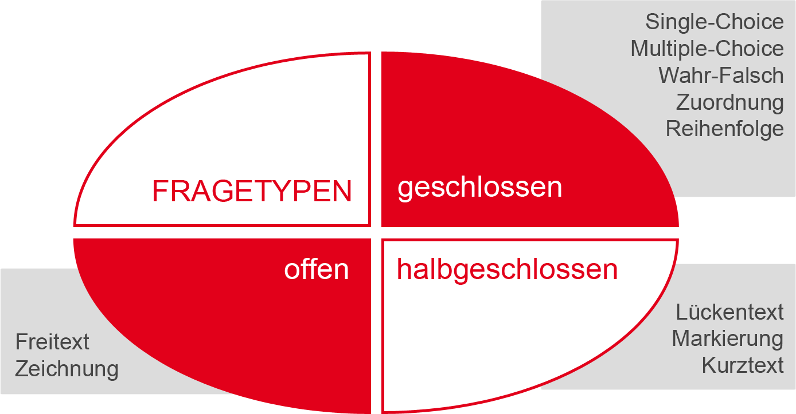
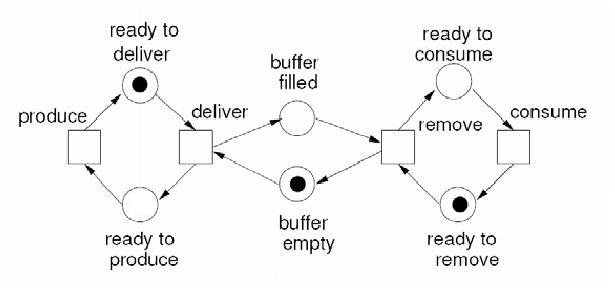
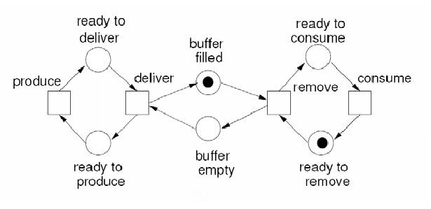
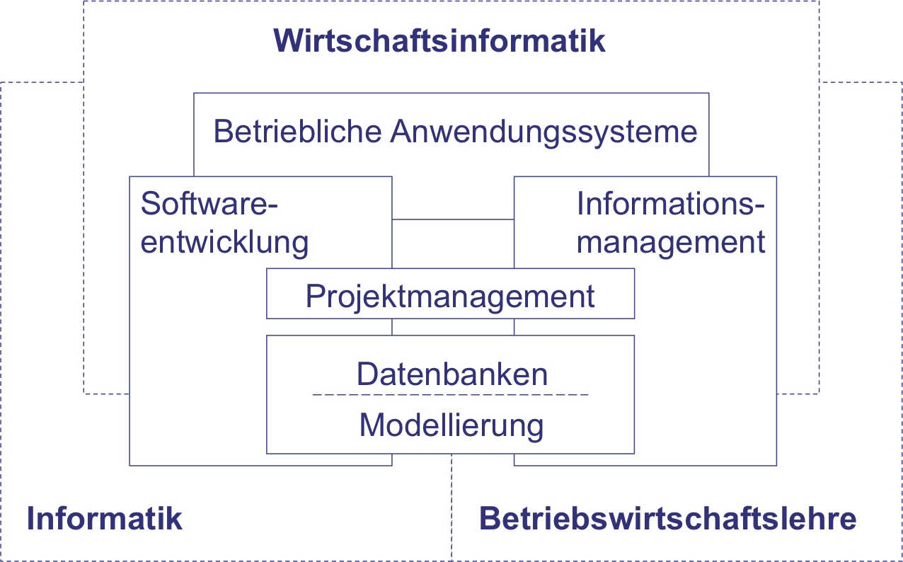
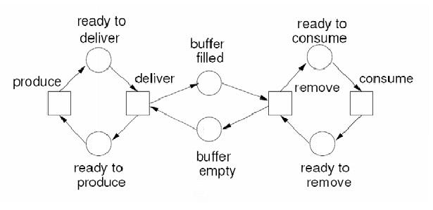
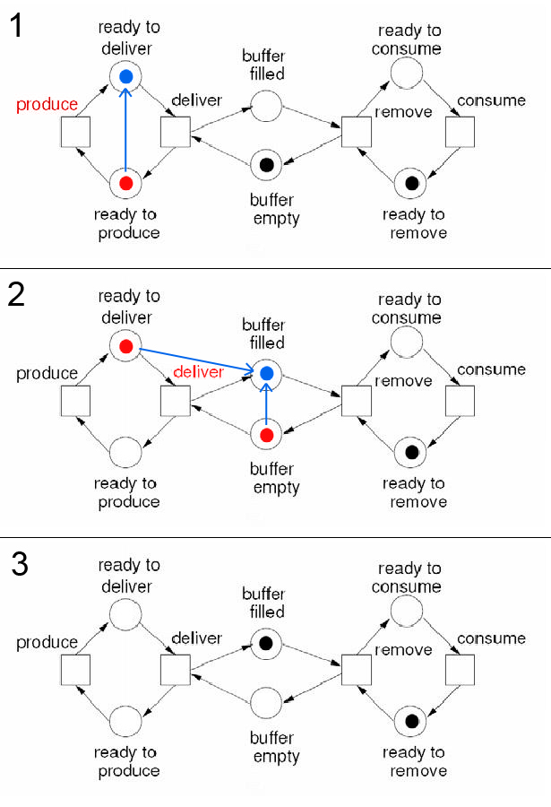
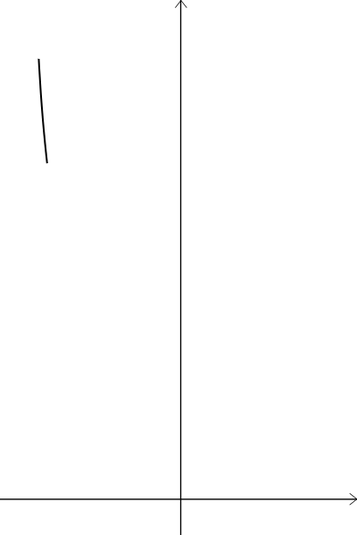
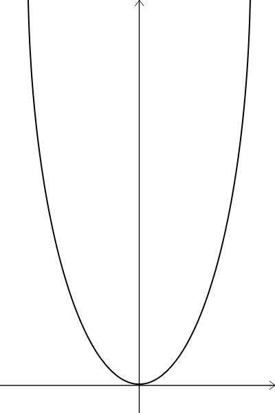

# Erstellung von Selbsttests <!--hide-in-overview-->

Julia Kühnemund und Arne Westphal  
eLearning Büro - MIN  
cc by-sa | 2016



## Inhaltsverzeichnis <!--hide-in-overview-->

<!-- Zusatz class="kachel" ändert die Darstellung -->
<!-- Zusatz class="hide-read" verhindert die Anzeige gelesener Sections -->
<div id="content-overview" class="">
    <!--
        Hier wird automatisch ein Inhaltsverzeichnis
        eingefügt, wenn das div#content-overview vorhanden
        ist.
    -->
</div>

## Verwendung von Selbsttestaufgaben

Die Quizfragen dienen dazu, die Aufmerksamkeit der Studierenden zu wecken
und sich selbst zu überprüfen. Sie geben die Möglichkeit, die wichtigsten
Aspekte in den Vordergrund zu rücken. Durch verschiedene Fragetypen kann man
abhängig vom Lernziel helfen, das Material u.a. zu verstehen, wiederholen,
einzuordnen oder zu lernen.


### Fragetypen <!--no-section-->

Die Fragen können _offen_ oder _geschlossen_ sein. Fragen mit kurzen Antworten kann
man als _halboffene_ oder _halbgeschlossene_ Fragen bezeichnen.

Die _geschlossene_ Form verlangt eine eindeutige Antwort, z.B. „Ja“ oder „Nein“.
Bei diesen Fragen sind die Antwortmöglichkeiten vorgegeben.

Die _offenen_ Fragen ermöglichen Antworten in beliebiger Form. Dabei
ist die Antwortform nur vom Lernziel abhängig. Die Studierenden können
ihre Antwort durch Auswählen oder Verschieben von Objekten und auch in Form
einer Zeichnung geben.

Alle diese Fragetypen haben ihre __Vor- und Nachteile__ und  müssen Lernziel
abhängig verwendet sein.


### Geschlossene und offene Fragen

__Geschlossene__ (konvergente) Fragen können automatisch ausgewertet werden,
d.h. die Studierenden können sofort nach jeder Frage oder am Ende des ganzen
Quiz ihren Kenntnisstand überprüfen und wenn vorgesehen bewerten lassen.
Außerdem ist die Benotung objektiv, da der Computer
immer die gleiche Bewertung für eine bestimmte Antwort gibt, ohne dabei
emotionale Bestandteile in die Benotung (schlechte Laune, Frustration oder
Ablenkung) einfließen zu lassen. Als Nachteil wird oft die Zufallsrate benannt,
d.h. die Studierende klicken ohne nachzudenken oder merken sich vorgegebene
Muster. Technischen Probleme können auch die Benotung beeinflussen. Aus diesem
Grund sind computerbasierte Prüfungen noch nicht sehr verbreitet. Und an den
Stellen, an denen computerbasierte Prüfungen stattfinden, gibt es die
Möglichkeit, den ganzen Prüfungsprozess durch Menschen zu kontrollieren,
z.B. in Papierform. Außerdem fehlt oft der rechtliche und organisatorische
Hintergrund.

Zurzeit sind folgende geschlossene Fragetypen verbreitet:

* Multiple-Choice
* Single-Choice
* Wahr-Falsch
* Zuordnung
* Rang-/Reihenfolge


Die __halbgeschlossenen__ Fragen können auch automatisch ausgewertet werden,
jedoch darf die Antwort nur aus einen vorgegeben, begrenzte Anzahl von Wörtern
bestehen. Bei Aufzählungen in der Antwort muss man zusätzliche Anweisungen
geben, z.B. „nur in alphabetische Reihenfolge“ oder „keine Wiederholung“, um
die Eindeutigkeit der Antwort zu gewährleisten.

Zu den halbgeschlossenen Fragen gehören: Kurztext, Lückentext, Hotspot und alle
andere Fragenformen, beim denen man etwas eintippen muss.  

__Offene__ Fragen können in der Regel nicht automatisch ausgewertet werden. Als
Alternative werden Musterlösungen dargestellt, welche man nach einer
bestimmten Zeit, auf Knopfduck oder nach der Abgabe der eigenen Antwort zum
Vergleich sehen kann.

Der Vorteil ist hier, dass die Frage nicht extra in eine geschlossene
umformuliert werden muss und die Studierenden beim Antworten in Struktur
und Form frei sind, wodurch sie unter Umständen ihre Kenntnisse besser
darstellen können. Die Bewertung ist aber nur durch eine Person und nicht
durch Computer realisierbar. Die Menschen sind immer subjektiv.

Die offene Aufgabenform ist vielseitig. Hier sind einige Beispiele:
Freitextaufgabe, Zeichnungsaufgabe, Begründungsaufgabe, Problemaufgabe
und Offene Situation.


### Auswahl des passenden Typen <!--no-section-->

Welcher Fragetyp gewählt wird sollte abhängig vom gewünschten Lernziel sein.
Dabei ist beispielsweise Kurztext eine Möglichkeit, um das begriffliche
Lernen zu unterstützen. Lückentexte können verwendet werden, um die
Aufmerksamkeit zu überprüfen. Um das Verständnis einer Person abzufragen,
eignen sich Markierungsaufgaben.

Für jede Frage, die man einbauen möchte, sollte man sich genau überlegen,
was das Ziel der Frage ist.


## Selbsttests mit quiz.js

Mit der quiz.js Erweiterung zum eLearn.js Projekt sind folgende Fragetypen
relisierbar:

* <a href="#" onclick="showSection('Einfach-, Mehrfach- und Bilderauswahl')">Multiple-Choice</a>
* <a href="#" onclick="showSection('Einfach-, Mehrfach- und Bilderauswahl')">Single-Choice</a>
* <a href="#" onclick="showSection('Einfach-, Mehrfach- und Bilderauswahl')">Wahr-Falsch</a>
* <a href="#" onclick="showSection('Matrix oder Tabellenaufgaben')">Matrix</a>
* <a href="#" onclick="showSection('Zuordnung (Drag and Drop)')">Zuordnung/Einordnen</a>
* <a href="#" onclick="showSection('Sortieren (Drag and Drop)')">Rang-/Reihenfolge/Sortieren</a>
* <a href="#" onclick="showSection('Lückentext mit Textfeldern')">Lückentext</a>
    * <a href="#" onclick="showSection('Lückentext mit Auswahl')">mit Auswahl vorgegebener Wörter</a>
    * <a href="#" onclick="showSection('Lückentext mit Textfeldern')">mit Eingabemöglichkeit</a>
    * <a href="#" onclick="showSection('Lückentext mit Textfeldern')">mit Eingabe vorgegebener Wörter</a>
    * <a href="#" onclick="showSection('Lückentext mit Textfeldern')">Ergänzung einer Tabelle/Matrix</a>
* <a href="#" onclick="showSection('Fehlertext oder Wortmarkierung')">Markierung</a>
    * <a href="#" onclick="showSection('Fehlertext oder Wortmarkierung')">Falsche oder richtige Wörter</a>
    * <a href="#" onclick="showSection('Hotspot')">Hotspot</a>
* <a href="#" onclick="showSection('Kurzantworten')">Kurztext</a>
* <a href="#" onclick="showSection('Freitextaufgaben')">Freitext</a>
* <a href="#" onclick="showSection('Zeichnen')">Bild/Graph zeichnen</a>
* <a href="#" onclick="showSection('Petrinetzaufgaben')">Einfache Petrinetzaufgaben</a>


Bei allen Fragetypen kann die eigene Antwort mit einer Musterlösung
verglichen werden. Zudem können die geschlossenen Fragen automatisch ausgewertet
werden, z.B. durch eine Anzeige von "Richtig" oder "Falsch". Die abgegebene
Antwort und die Musterlösung kann an einer beliebigen Stelle vom Skript
abgerufen/gezeigt, wieder geschlossen und zurückgesetzt werden.


## Technische Grundlage

Im folgenden werden HTML Elemente immer wieder abgekürzt beschrieben.
Dabei handelt es sich um die CSS Schreibweisen zur Spezifikation von Elementen.
CSS ist eine Sprache, um das Aussehen der angezeigten Seite zu definieren.
Wie man mit CSS das Aussehen verändert wird im Abschnitt
<a href="#" onclick="showSection('Veränderte Darstellung (CSS)')">_Veränderte Darstellung (CSS)_</a>
noch grundsätzlich erklärt.
Elemente wie `<div>` werden dabei einfach nur _div_ genannt.
Die Klassen der Elemente werden jeweils mit einem einzelnen Punkt begonnen.
_div.eins_ würde also z.B. `<div class="eins">` entsprechen.
Das Feld _id_ wird mit einem einzelnen _#_ begonnen.
_div#eins_ würde also z.B. `<div id="eins">` entsprechen.
Diese Teile lassen sich beliebig oft aneinander hängen.


## Manuell Quizelemente in HTML schreiben

Durch die Erweiterungen in quiz.js Version 0.3.0 wurde viele Quiztypen
hinzugefügt. Da der OSAEditor diese nicht unterstützt, lohnt sich eine
manuelle Erstellung der Elelemente im Quelltext.

Um dies zu vereinfachen folgen detaillierte Beispiele. Zusätzliche Beispiele
mit Quelltextkommentaren sind in der "quizJS_examples.html" zu finden.
Ansehen kann man sich diese hier: <a href="quizJS_examples.html">Link</a>.


### Grundgerüst

    <div class="question" qtype="short_text" id="short_1">
    <h4>
      <b>Frage 1:</b><br>
      Freitext Frage
    </h4> <!-- Fragetext -->

    <!--
    Block indem Antworten stehen
    -->
    <div class="answers">
        <label>Lösung: <input type="text" name="q"/></label>
    </div>

    <!-- Feedback für eine richtige Antwort -->
    <div class="feedback correct">
        Richtig
    </div>

    <!-- Feedback für eine falsche Antwort -->
    <div class="feedback incorrect">
        Falsch
    </div>

    <!-- Verschlüsselt ist hier das Wort "antwort" -->
    <a class="ans">693da517cf61c81742ef090221bfd5d6</a>
    </div>

Dieses Grundgerüst beinhaltet ersteinmal alles was benötigt wird.
Man kann überall Bilder einfügen. Empfohlen wird es, ein Bild zur Frage
zwischen der Überschrift (_h4_) und dem Antwortenblock (_div.answers_)
einzufügen.

Es ergibt sich:

<div class="question" qtype="short_text" id="q_short_text">
    <h4>
      <b>Frage 1:</b><br>
      Freitext Frage
    </h4> <!-- Fragetext -->

    <!--
    Block indem Antworten stehen
    -->
    <div class="answers">
        <label>Lösung: <input type="text" name="q"/></label>
    </div>

    <!-- Feedback für eine richtige Antwort -->
    <div class="feedback correct">
        Richtig
    </div>

    <!-- Feedback für eine falsche Antwort -->
    <div class="feedback incorrect">
        Falsch
    </div>

    <a class="ans">693da517cf61c81742ef090221bfd5d6</a>
</div>


### Fragetypen

In der ersten Zeile tauchen bereits Variable Werte auf, die angepasst werden müssen.

    <div class="question" qtype="short_text" id="short_1">

In diesem Fall die Felder __qtype__ und __id__. Die __id__ ist nur für das
Referenzieren einer Frage, dazu gibt es den extra Abschnitt Referenzieren.

Das Feld __qtype__ definiert den Typ der Frage. Hier gibt es mittlerweile einige
verschiedene. Hier eine Liste aller Fragetypen aus der aktuellen Version (0.3.2):

* __short_text__: Ein kleines Textfeld. Normalerweise für ein Wort
* __choice__: Auswahl als Single- oder Multiple-Choice (Auch Bilderauswahl)
* __free_text__: Größeres Textfeld, für längere Texte (unbewertet)
* __fill\_blank__: Lückentext mit Textfeldern. Funktioniert wie mehrere short_text
Felder
* __fill\_blank\_choice__: Lückentext mit Auswahlboxen (Liste aus Begriffen/Sätzen
zur Auswahl)
* __error_text__: Fehlertext. Hier lassen sich Wörter markieren in Form von
Unter- oder Durchstreichen
* __matrix\_choice__: Wie choice nur in Tabellenform für mehrere Aufgaben
* __hotspot__: Vorgegebene Punkte auf einem Bild müssen Begriffen zugeordnet werden
* __classification__: Zuordnung. Bilder oder Texte in Felder einsortieren
* __order__: Reihenfolge/Ordnen. Bilder oder Texte in die richtige Reihenfolge bringen
* __petri__: Petrinetz. Plätze können markiert werden. Mehrere Schritte möglich
* __drawing__: Zeichnen. Freies Zeichnen auf einem Hintergrundbild (unbewertet)

Die einzelnen Aufgabentypen werden weiter unten noch genauer ausgeführt.


### Überschrift

Die einzelnen Bereiche sind schnell erklärt.

    <h4>
      <b>Frage 1:</b><br>
      Freitext Frage
    </h4>

In dem _h4_ Bereich Steht einfach die Überschrift bzw. Frage. Hier kann z.B.
_i_ oder _b_ verwendet werden, um Text einfach hervorzuheben.


### Antworten

    <div class="answers">
      <label>Lösung: <input type="text" name="q"/></label>
    </div>

In dem _div.answers_ Bereich werden alle Antwortmöglichkeiten angegeben.
In diesem Beispiel handelt es sich um ein einfaches Textfeld in welches
Freitext eingegeben wird. Dieses Beispiel ist aus __qtype__="short_text".

Andere Möglichkeiten sind (für __qtype__="choice"):

    <!-- Mehrfachauswahl -->

    <div class="answers multiple">
      <label><input val="Antwort 1">Antwort 1</input></label>
      <label><input val="Antwort 2">Antwort 2</input></label>
    </div>


    <!-- Einzelauwahl -->

    <div class="answers single">
        ...


    <!-- Bildauswahl -->

    <div class="answers single">
        <label class="img_radio">
          <input val="bild1"/>
          
        </label>
        <label class="img_radio">
            ...
    </div>

Hier sind jeweils nur Beispiele genannt. Diese Beispiele kann man kopieren
und folgende Werte anpassen:

* __value:__ Dieser Wert wird später verschlüsselt angegeben, um eine richtige
  Antwort zu kennzeichnen. Dazu später mehr. __Achtung__ bei Auswahlaufgaben
  wird __val__ statt __value__ verwendet.
* __src:__ Die Bilddatei bei der Bildauswahl. Dieser Name muss _nicht_ mit
  dem value übereinstimmen.
* __style:__ kann je nach Bedarf angepasst werden, damit das gewünschte
  Ergebnis erzielt wird. (Hierbei handelt es sich um CSS Befehle)
* __texte:__ In den _label_ Bereichen stehen meist einzeln Texte. Diese
  sind die sichtbaren Antworten die angezeigt werden.


### Feedbacktexte

    <!-- Feedback für eine richtige und falsche Antwort -->
    <div class="feedback correct incorrect">
      Richtig
    </div>

Hier wird der Textblock definiert, der angezeigt wird, wenn eine richtige
oder falsche Antwort gegeben wurde. In diesem Block lassen sich neben
_b_ und _i_ z.B. auch Links angeben als _a_ oder Bilder als _img_\.

In diesem Fall steht der eine Text sowohl für eine richtige als auch eine
falsche Antwort. Um diese Bereiche einzeln zu definieren kann man die
Bereiche wie in dem Grundgerüst gezeigt aufteilen.


### Angabe der richtigen Antworten

Für jede richtige Antwort wird genau ein _a_ Block verwendet.

    <!-- Verschlüsselt ist hier das Wort "antwort" -->
    <a class="ans">693da517cf61c81742ef090221bfd5d6</a>

Der Text der in diesem Block steht ist der Wert des __value__ Feldes
der jeweiligen Antwort, bzw. bei Texteingaben einfach die gewünschte
Eingabe, per md5 verschlüsselt. Natürlich sollte man hier nicht immer die
unverschlüsselte Version direkt darüber schreiben. Dies ist nur als Hilfe
gedacht.

Zur generierung der MD5-Verschlüsselten Antworten eignet sich z.B.
<a href="http://www.md5-generator.de/">http://www.md5-generator.de/</a> . Man sollte darauf achten, keine zusätzlichen
Leerzeichen oder Zeilenumbrüche dort einzugeben.

Bei mehreren richtigen Antworten stehen also einfach mehrere _a_ Blöcke
untereinander.

Behandelt werden mehrere richtige Antworten wie folgt:

* __Checkbox:__ Jede richtige Antwort muss angekreuzt werden, sonst gilt
  die Frage als falsch beantwortet.
* __Textfeld:__ Eine der richtigen Antworten muss eingegeben werden.


## Einzelne Fragetypen

Seit der quiz.js Version 0.3.0, welche ergänzend zur eLearn.js Version 0.9
entwickelt wurde, gibt es mehr Fragetypen. Hier werden die einzelnen Typen
in ihrer Funktionsweise und Verwendung erklärt.


### Kurzantworten: _short\_text_

Beispiel:

<div class="question" qtype="short_text" id="q_short_text_2">
    <h4>
      <b>Frage 1:</b><br>
      Gib das Wort "antwort" ein.
    </h4> <!-- Fragetext -->

    <!--
    Block indem Antworten stehen
    -->
    <div class="answers">
        <label>Lösung: <input type="text" name="q"/></label>
    </div>

    <!-- Feedback für eine richtige Antwort -->
    <div class="feedback correct">
        Richtig!
    </div>

    <!-- Feedback für eine falsche Antwort -->
    <div class="feedback incorrect">
        Falsch.
    </div>

    <a class="ans">693da517cf61c81742ef090221bfd5d6</a>
</div>

#### Technische Umsetzung

Dieser Typ funktioniert genau wie oben beschrieben. In dem
 _div.answers_ befindet sich folgendes

    <label>Lösung: <input type="text" name="q"></label>

Dabei kann natürlich der Text "Lösung:" beliebig verändert werden. Er
kann auch außerhalb des _label_ stehen.


### Einfach-, Mehrfach- und Bilderauswahl: _choice_

Hier ein Beispiel für eine Mehrfachauswahl:

<!--
Fragetyp AUSWAHLFRAGE (Multiple/Single Choice)

Eine Frage mit mehrere Antwortmöglichkeiten.
-->
<div class="question" qtype="choice" id="q_choice">
    <h4>Welche Unterordner werden in der Dateistruktur von digitalen Skripten erwartet?</h4>


    <div class="answers multiple">
        <!--
        Definition der Antwortmöglichkeiten.
        type="checkbox" gibt an, dass es eine multiple Choice Frage ist.
        Bei single Choice wäre dies type="radio".
        name="q" sollte jeweils gleich sein bei Single Choice Fragen,
        damit immer nur eine Antwort auswählbar ist.

        Das value="..." wird jeweils als MD5 verschlüsselt als richtige Antwort angegeben.
        -->
        <label><input val="Frage2-1">assets</label>
        <label><input val="Frage2-2">movies</label>
        <label><input val="Frage2-3">img</label>
        <label><input val="Frage2-4">css</label>
        <label><input val="Frage2-5">lang</label>
    </div>

    <!--
    Diese Blöcke werden angezeigt, jenachdem ob die
    Antwort richtig (.correct) oder falsch (.incorrect) war.
    In diesem Block kann ein erklärender Text und auch Bilder
    verwendet werden.
    -->
    <div class="feedback correct">
        Genau, diese Ordner werden auf jeden Fall benötigt. Sogar noch ein paar mehr.
    </div>
    <div class="feedback incorrect">
        Deine Antwort ist leider nicht ganz richtig. Entweder fehlt ein Ordner, oder du hast einen ausgewählt, der nicht benötigt wird.
    </div>

    <!--
    Hier werden alle richtigen Antwortmöglichkeiten angegeben.
    (Verschlüsselt wird der value Wert)
    Diese werden einfach per MD5 verschlüsselt hier eingefügt.
    Je eine antwort in einem <a class="ans">...</a>
    -->
    <a class="ans">b5ceb729a1b347aa357790e1588c88b3</a>
    <a class="ans">1fd302a9c89fc92eead418857a7e5a07</a>
    <a class="ans">4fc364339b2127eb81c13ab986a27085</a>
</div>

#### Technische Umsetzung

Auch hiervon wurden Teile bereits zuvor bereits beschrieben. Hierzu sollte man
im Bereich __Antworten__ nachsehen.

Die Bildauswahl ist das vermutlich einzige Konstrukt welches in vielen
Fällen speziell angepasst werden muss. Der Umgang mit verschieden großen
Bildern ist nicht genug automatisiert. Hier muss man also per __style__
vorgeben, wie die Bilder genau dargestellt werden sollen.

Bei der Bildauswahl kann man für das _.answers_ Element als __class__ sowohl
_.multiple_ als auch _.single_ nehmen.

Ein Beispiel für eine Bild-Einzelauswahl wäre:

<div class="question" qtype="choice" id="q_choice_bild">
    <h4>Bildauswahl</h4>

    Wie sieht das folgende Petri Netz aus, wenn <b>produce</b>
    geschaltet wird?

    <br>
    

    <div class="answers single">
        <!--
        Definition der Antwortmöglichkeiten.
        type="checkbox" gibt an, dass es eine multiple Choice Frage ist.
        Bei single Choice wäre dies type="radio".
        name="q" sollte jeweils gleich sein bei Single Choice Fragen,
        damit immer nur eine Antwort auswählbar ist.

        Das value="..." wird jeweils als MD5 verschlüsselt als richtige Antwort angegeben.
        -->
        <label class="img_radio">
          <input val="bild1"/>
          
        </label>
        <label class="img_radio">
          <input val="bild2"/>
          
        </label>

    </div>

    <!--
    Diese Blöcke werden angezeigt, jenachdem ob die
    Antwort richtig (.correct) oder falsch (.incorrect) war.
    In diesem Block kann ein erklärender Text und auch Bilder
    verwendet werden.
    -->
    <div class="feedback correct">
        <b>Richtig</b>
    </div>
    <div class="feedback incorrect">
        <b>Falsch</b>
    </div>

    <!--
    Hier werden alle richtigen Antwortmöglichkeiten angegeben.
    (Verschlüsselt wird der value Wert)
    Diese werden einfach per MD5 verschlüsselt hier eingefügt.
    Je eine antwort in einem <a class="ans">...</a>
    -->
    <a class="ans">e0f7fbd4c18827653333ba13ca57d5c9</a>
</div>


### Freitextaufgaben: _free\_text_

Hierbei handelt es sich um ein größeres Textfeld in das längere
Antworten eingegeben werden können. Diese werden __nicht__
überprüft, da es sich um einen offenen Fragetypen handelt. Dieser Typ ist also
nur für Aufgaben mit Selbstkontrolle geeignet.

Ein Beispiel für eine Freitextfrage:

<div class="question" qtype="free_text" id="q_free_text">
    <h4>Welche Unterordner werden in der Dateistruktur von digitalen Skripten erwartet?</h4>

    Bei digitalen Skripten könnten viele verschiedene Ordner angelegt werden.
    Welche davon sind aber wirklich wichtig und werden generell erwartet?
    <br>

    <div class="answers">
        <label>
            Antwort:
            <textarea></textarea>
        </label>
    </div>

    <!--
    Dieser Block wird angezeigt, wenn die Frage beantwortet wurde.
    In diesem Block kann ein erklärender Text und auch Bilder
    verwendet werden.
    -->
    <div class="feedback information">
        <b>Richtige Antwort:</b><br>
        Die Ordner "assets", "img" und "css" sollten immer vorhanden sein.
    </div>
</div>

#### Technische Umsetzung

Hierzu wird im _div.answers_ folgendes eingefügt:

    <label>
        Antwort:
        <textarea></textarea>
    </label>

Natürlich ist auch hier der Text "Antwort:" beliebig veränderbar.
Er kann auch weggelassen werden.

Da diese Aufgabe nicht kontrolliert wird, müssen auch keine
richtigen Antworten angegeben werden. Im Feedbacktext kann man
natürlich korrekte Lösungen erklären.

Anders als oben beschrieben gibt es hier keinen Feedbacktext für
richtige Antworten und ebenfalls keinen für falsche sondern
nur einen generellen, der immer nach der Beantwortung angezeigt
wird. Dieser sieht wie folgt aus:

    <div class="feedback information">
        <b>Richtige Antwort:</b><br>
        Text
    </div>

Innerhalb dieses _div_ kann man einfügen was man möchte. Es sind
also auch Bilder möglich. Das Beispiel _b_ druckt den Text innerhalb
fett.
Diese Art von Feedbacktext wird auch noch bei anderen Fragetypen
genutzt.


### Lückentext mit Textfeldern: _fill\_blank_

Ein Beispiel für einen Lückentext:

<div class="question" qtype="fill_blank" id="q_fill_blank">
    <h4>Fülle die Lücken im Text wie oben beschrieben!</h4>

    <div class="answers">
        Hier wäre ein langer Text mit
        <label><input id="0" type="text"></label>
        und diese müssen
        <label><input id="1" type="text"></label>
        werden.
    </div>

    <!--
    Dieser Block wird angezeigt, wenn die Frage beantwortet wurde.
    In diesem Block kann ein erklärender Text und auch Bilder
    verwendet werden.
    -->
    <div class="feedback correct">
        <b>Richtig!</b><br>
    </div>
    <div class="feedback incorrect">
        <b>Falsch.</b><br>
        Der Text sollte wie folgt lauten:
        <i>Hier wäre ein langer Text mit <b>Lücken</b>
        und diese müssen <b>gefüllt</b> werden.</i>
    </div>

    <a class="ans" id="0">6497dcbced26ee0f510bf82de5234653</a>
    <a class="ans" id="1">2c8b2465235308f69defd8ae2e46cdd3</a>
</div>

#### Technische Umsetzung

Dieser Aufgabentyp erlaubt es mehrere Textfelder zu haben, die
alle funktionieren wie in einer _short\_text_ Aufgabe. Als korrekt
gilt die Antwort nur, wenn alle eingegebenen Wörter korrekt sind.

Hier kann man für jede Lücke mehrere korrekte Antwort angeben,
bei der Groß- und Kleinschreibung entscheident sind! Empfohlen
ist diese Aufgabe also eigentlich nur, wenn man Lösungswörter
vorgibt, die einsortiert werden sollen. Generell wird eher
_fill\_blank\_choice_ empfohlen.

Ein Beispiel für den Teil innerhalb des _div.answers_ ist:

    Hier wäre ein langer Text mit
    <label><input id="0" type="text"></label>
    und diese müssen
    <label><input id="1" type="text"></label>
    werden.

In die erste Lücke soll dabei "Lücken" eingesetzt werden,
in die zweite "gefüllt".

Wichtig ist, dass die _id_ Felder für jede Lücke unterschiedlich
sind und sich nicht wiederholen, damit man die richtigen Antworten
angeben kann. Jedes _input_ muss in einem _label_ sein.

Die Angabe der Antworten erfolgt ähnlich wie bereits zuvor.
Hier der Block für dieses Beispiel:

    <a class="ans" id="0">6497dcbced26ee0f510bf82de5234653</a>
    <a class="ans" id="1">2c8b2465235308f69defd8ae2e46cdd3</a>

Das erste _a_ verweist durch seine _id_ auf das erste _input_,
welches dieselbe _id_ hat. Hier verschlüsselt ist also die Antwort
für diese Lücke. Verschlüsseln tut man die Antwort wie bereits zuvor
erklärt.
Für jedes _input_ muss also ein _a_ mit übereinstimmender _id_
erstellt werden, indem die jeweilige Antwort verschlüsselt ist.
Möchte man für ein Feld mehrere richtige Antwortmöglichkeiten angeben, erstellt
man mehrere _a_ mit derselben _id_ die unterschiedliche verschlüsselte
Antworten enthalten. Überprüft wird, ob die gegebene Antwort mit einer der
angegebenen Möglichkeiten übereinstimmt.


### Lückentext mit Auswahl: _fill\_blank\_choice_

Ein Beispiel für einen Lückentext:

<div class="question" qtype="fill_blank_choice" id="q_fill_blank_choice">
    <h4>Fülle die Lücken im Text wie oben beschrieben!</h4>

    <div class="answers">
        Hier wäre ein langer Text mit

        <!-- Auswahlblock -->
        <label>
            <select id="0">
                <option>Elefanten</option>
                <option>Lücken</option>
            </select>
        </label>

        und diese müssen

        <!-- weiterer Auswahlblock -->
        <label>
            <select id="1">
                <option>gefüllt</option>
                <option>überbacken</option>
            </select>
        </label>

        werden.
    </div>

    <!--
    Dieser Block wird angezeigt, wenn die Frage beantwortet wurde.
    In diesem Block kann ein erklärender Text und auch Bilder
    verwendet werden.
    -->
    <div class="feedback correct">
        <b>Richtig!</b><br>
    </div>
    <div class="feedback incorrect">
        <b>Falsch.</b><br>
        Der Text sollte wie folgt lauten:
        <i>Hier wäre ein langer Text mit <b>Lücken</b>
        und diese müssen <b>gefüllt</b> werden.</i>
    </div>

    <a class="ans" id="0">6497dcbced26ee0f510bf82de5234653</a>
    <a class="ans" id="1">2c8b2465235308f69defd8ae2e46cdd3</a>
</div>

#### Technische Umsetzung

Diese Art von Lückentext funktioniert ähnlich wie die vorherige.
Allerdings wird hier für jede Lücke eine Auswahl an
Antwortmöglichkeiten vorgegeben, von denen nur eine richtig ist.

Innerhalb des _div.answers_ werden die _input_ ersetzt durch
_select_:

    Hier wäre ein langer Text mit

    <!-- Auswahlblock -->
    <label>
        <select id="0">
            <option>Elefanten</option>
            <option>Lücken</option>
        </select>
    </label>

    und diese müssen

    <!-- weiterer Auswahlblock -->
    <label>
        <select id="1">
            <option>gefüllt</option>
            <option>überbacken</option>
        </select>
    </label>

    werden.

Jedes _select_ muss in einem _label_ sein. Innerhalb eines _select_
können beliebig viele _option_ eingebaut werden. Diese können
auch in verschiedenen _select_ mehrfach auftauchen.

Die Angabe der Antworten erfolgt ähnlich wie bereits zuvor.
Hier der Block für dieses Beispiel:

    <a class="ans" id="0">6497dcbced26ee0f510bf82de5234653</a>
    <a class="ans" id="1">2c8b2465235308f69defd8ae2e46cdd3</a>

Das erste _a_ verweist durch seine _id_ auf das erste _select_,
welches dieselbe _id_ hat. Hier verschlüsselt ist also die Antwort
für diese Lücke. Verschlüsselt wird die Antwort wie bereits zuvor
erklärt.
Für jedes _select_ muss also ein _a_ mit übereinstimmender _id_
erstellt werden, indem die jeweilige Antwort verschlüsselt ist.
Möchte man für ein Feld mehrere richtige Antwortmöglichkeiten angeben, erstellt
man mehrere _a_ mit derselben _id_ die unterschiedliche verschlüsselte
Antworten enthalten. Überprüft wird, ob die gegebene Antwort mit einer der
angegebenen Möglichkeiten übereinstimmt.


### Fehlertext oder Wortmarkierung: _error\_text_

Ein Beispiel für einen Fehlertext:

<div class="question" qtype="error_text" id="et_1">
    <h4>Streiche falsche Wörter</h4>
    <div class="answers">
        <!--
        Hier steht der Text. Durchstreichbare Begriffe werden
        in ein <button class="error_button">...</button> eingebettet.
        Ansonsten stehen sie normal im Text.
        Hier können auch Bilder eingebaut werden, um etwas
        zu illustrieren. Markierbar sind aber nur Wörter.
        -->
        In Deutschland gibt es die Flüsse <button class="error_button">Elbe</button>,
        <button class="error_button">Wolga</button>,
        <button class="error_button">Mississippi</button> und
        <button class="error_button">Weser</button>.
        <!--
        Die gleiche Antwort wie z.B. Elbe darf innerhalb einer Frage nicht einmal falsch und einmal richtig sein. Möglichst gleiche Antworten vermeiden.
        -->
    </div>

    <!--
    Diese Blöcke werden angezeigt, jenachdem ob die
    Antwort richtig (.correct) oder falsch (.incorrect) war.
    In diesem Block kann ein erklärender Text und auch Bilder
    verwendet werden.
    -->
    <div class="feedback correct">
        <b>Richtig!</b><br>
    </div>
    <div class="feedback incorrect">
        <b>Falsch.</b><br>
        Die Flüsse "Wolga" und "Mississippi" hätten gestrichen werden müssen.
    </div>

    <!--
    Hier werden die zu markierenden Wörter definiert.
    Da hier falsche Wörter durchgestrichen werden sollen,
    sind dies die Wörter "Wolga" und "Mississippi".
    Diese Wörter werden per MD5 Verschlüsselt und hier eingetragen.
    Die hier vorhandenen Blöcke geben bereits Wolga und Mississippi an.
    -->
    <a class="ans">54b851fdfcb598592d15214f24c6fdc7</a>
    <a class="ans">14c5492ce2fe855f408481fdbd13f7a6</a>
</div>

#### Technische Umsetzung

Dieser Aufgabentyp ist dazu gedacht, in einem Fließtext Wörter
durch- oder unterstreichen zu können. So kann man z.B. falsche
Wörter durchstreichen oder richtige Wörter unterstreichen. Je
Aufgabe ist allerdings nur eine Art der Markierung möglich.

Standardmäßig werden angeklickte Wörter durchgestrichen. Um das
umzuschalten und eine Unterstreichen zu ermöglichen, muss das
_div.answers_ um die Klasse __underline__ erweitert werden.

    <div class="answers underline">

In das _div.answers_ schreibt man dann den gewünschten Text.
Markierbare Wörter werden wie folgt eingebaut:

    <button class="error_button">Wort</button>

Hier kann der Text "Wort" wieder beliebig verändert werden. Es
können theoretisch auch Ganze Sätze innerhalb eines Buttons
verwendet werden. Jedes markierbare Wort muss in einen solchen
_button_ eingebaut werden. Es kann beliebig viele _button_ geben.

Als richtige Antwort wird angegeben, welche Wörter __markiert__
werden sollen, also entweder unter- oder durchgestrichen.
Verschlüsselt wird der Teil innerhalb des _button_.
Im oberen Beispiel müsste also "Wort" verschlüsselt werden, was
folgendes ergibt:

    <a class="ans">7e2aa751bdcb1636344f39483040e3e1</a>

Wörter die nicht markiert werden sollen, werden ignoriert.


### Matrix: _matrix\_choice_

Ein Beispiel für eine Matrixaufgabe:

<div class="question" qtype="matrix_choice" id="mc_1">
    <h4>Wähle aus, ob die Aussagen richtig oder falsch sind</h4>
    <div class="answers single">
    <table class="matrix">
            <tr>
                <td>Aufgabe</td>
                <th id="wahr" class="antwort">Wahr</th>
                <th id="falsch" class="antwort">Falsch</th>
            </tr>

            <tr id="0">
                <td>Ein Elefant ist grau.</td>
            </tr>

            <tr id="1">
                <td>Lügen haben lange Beine.</td>
            </tr>
        </table>
    </div>

    <!--
    Diese Blöcke werden angezeigt, jenachdem ob die
    Antwort richtig (.correct) oder falsch (.incorrect) war.
    In diesem Block kann ein erklärender Text und auch Bilder
    verwendet werden.
    -->
    <div class="feedback correct">
        <b>Richtig!</b><br>
    </div>
    <div class="feedback incorrect">
        <b>Falsch.</b><br>
        Elefanten sind grau und Lügen haben sprichwörtlich <i>kurze</i> Beine.
    </div>

    <!--
    Hier werden die zu markierenden Wörter definiert.
    Da hier falsche Wörter durchgestrichen werden sollen,
    sind dies die Wörter "Wolga" und "Mississippi".
    Diese Wörter werden per MD5 Verschlüsselt und hier eingetragen.
    Die hier vorhandenen Blöcke geben bereits Wolga und Mississippi an.
    -->
    <a id="0" class="ans">c90c13507fc364353401f4e04939a619</a>
    <a id="1" class="ans">8042c2ef76e94fb1b546ec621c46c769</a>
</div>

#### Technische Umsetzung

Matrix Aufgaben funktionieren wie _choice_ Aufgaben in einer
Tabellenform. Dabei können mehrere Aufgaben mit gleichen
Antwortmöglichkeiten untereinander abgefragt werden.

Für die Erstellung wird auf die HTML-Tabelle _table_
zurückgegriffen:

    <div class="answers single">
        <table class="matrix">
            <tr>
                <td>Aufgabe</td>
                <th id="wahr" class="antwort">Wahr</th>
                <th id="falsch" class="antwort">Falsch</th>
            </tr>

            <tr id="0">
                <td>Ein Elefant ist grau.</td>
            </tr>

            <tr id="1">
                <td>Lügen haben lange Beine.</td>
            </tr>
        </table>
    </div>

Dieser Block kann so kopiert, verändert und erweitert werden.
Das äußere _table_ sollte dabei unverändert bleiben. Die _tr_
Elemente stehen für die Zeilen der Tabelle. Die oberste Zeile
enthält die Antwortmöglichkeiten und eventuell in der ersten
Spalte etwas wie "Aufgabe", was die Spalte beschreibt, in der
die Aufgaben stehen.
Jedes _td_ entspricht einer Spalte innerhalb der Zeile, also genau
genommen der exakten Zelle. Die Elemente _th_ verhalten sich genau
so, stehen aber für "header" Zellen. Diese werden in diesem Fall
verwendet um die Antwortmöglichkeiten hervozuheben.
In jeder Zeile _tr_ müssen sich zusammengerechnet die gleiche
Anzahl an _td_ und _th_ befinden.

__Erste Zeile__:
Die _id_ der beiden _th.antwort_ wird für die Angabe der richtigen
Antworten jeder Zeile benötigt. Sie sollte also für jede
Antwortmöglichkeit einzigartig sein. Die Klasse _antwort_ muss bei
den vorgegebenen Antwortmöglichkeiten beibehalten bleiben.
Innerhalb der _th.antwort_ steht nun der Text der angezeigt wird.
Möchte man eine größere Auswahl an Antwortmöglichkeiten haben,
können weitere _th.antwort_ Elemente dort eingefügt werden.

Nach der ersten Zeile kommen dann die eigentlichen Aufgaben.
Jede Zeile muss eine einzigartige _id_ bekommen (abgesehen von der
obersten Zeile). Diese können z.B. durchnummeriert werden.
Innerhalb der Zeile steht dann in dem ersten _td_ ein Aufgabentext
(erste Spalte). Die Auswahloptionen für den Nutzer werden automatisch eingefügt.
Um zwischen __Einfach-__ und __Mehrfachauswahl__ zu unterscheiden, erhält das
_div.answers_ die zusätzliche Klasse _single_ oder _multiple_:

    Einfachauswahl
    <div class="answers single">

    Merhfachauswahl
    <div class="answers multiple">


Um hier nun die richtigen Antworten anzugeben, muss man einige Dinge
beachten. Angegeben werden nur die Boxen, die markiert werden sollen.
Die _id_ des _a.ans_ entspricht der _id_ der Zeile zu der
die Antwort gehört. Verschlüsselt wird die _id_ des _th.antwort_,
welches richtig ist.

Im oberen Beispiel ist die Antwort der Zeile mit der _id_ 0 "wahr", also
wird die _id_ "wahr" verschlüsselt.
Das _a.ans_ enthält nun die _id_ 0, da es zu dieser Zeile gehört und
die MD5-Verschlüsselte Form von "wahr" als inneren Text.

    <a id="0" class="ans">c90c13507fc364353401f4e04939a619</a>

Müssen in einer Zeile mehrere Spalten markiert werden, gibt es mehrere
_a.ans_ mit derselben _id_, aber unterschiedlichen Werten. Dies ist nur
bei Mehrfachauswahl möglich.


### Hotspot: _hotspot_

Ein Beispiel für eine Hotspot-Aufgabe:

<div class="question" qtype="hotspot" id="hs_1">
    <h4>Hotspot</h4>

    Markiere die Stelle an die der folgende Begriff gehört:
    <!--
    das span element mit der Klasse gesucht wird genutzt
    um die Bezeichnung des gesuchten Elements anzuzeigen.
    Dieser Block kann frei verschoben werden, jenachdem
    wo er für die Frage gut hinpasst.
    Mit CSS Kenntnis kann auch frei der Stil geändert
    werden.
    Die Schachtelung in ein <b> sorgt für das fettdrucken.
    -->
    <b><span class="gesucht"></span></b>
    <br>

    <div class="answers">

        <!--
        Das zusätzliche shuffle sorgt dafür, dass die
        Antworten in einer zufälligen Reihenfolge abgefragt
        werden.
        -->
        <div class="hotspot_image shuffle">

            <!--
            Dieses Bild ist der Hintergrund, auf dem Punkte
            markiert werden können. Wo diese Punkte sind wird
            direkt danach definiert.
            -->
            

            <!--
            Angaben der auswählbaren Objekte
            Die Position wird als Abstand zum oberen und
            linken Bildrand angegeben.

            Diese Punkte werden sichtbar, wenn man mit der Maus
            über das Bild fährt oder es auf Mobilgeräten einmal
            antippt.

            Zu jedem Begriff kann nur ein Punkt markiert werden.
            Die Begriffe sollten also eindeutig zugeordnet werden
            können.

            Die Klasse "hotspot" muss bleiben.
            Die ID ist das was als korrekte Antwort verschlüsselt wird.
            -->
            <div style="top: 25%; left: 50%;" class="hotspot" id="obj1"></div>
            <div style="top: 40%; left: 28.5%;" class="hotspot" id="obj2"></div>
            <div style="top: 40%; left: 71.5%;" class="hotspot" id="obj3"></div>
            <div style="top: 52%; left: 50%;" class="hotspot" id="obj4"></div>
            <div style="top: 70%; left: 50%;" class="hotspot" id="obj5"></div>
        </div>

    </div>

    <!-- Bei Hotspot gibt es nur eine generelle Rückmeldung -->
    <!-- Hier sollte also kein "Richtige Antwort" stehen -->
    <div class="feedback correct">
        <b>Richtig</b>
    </div>
    <div class="feedback incorrect">
        <b>Falsch</b>
    </div>

    <!--
    Dieser Text wird angezeigt, wenn alle Begriffe abgefragt wurden.
    Dabei mussten nicht alle richtig sein.
    -->
    <div class="feedback information">
        Hier das korrekt ausgefüllte Bild:
        
    </div>

    <!--
        Verschlüsselt ist die id des zugehörigen Punkts
    -->
    <a id="Betriebliche Anwendungssysteme" class="ans">24f682f769992022dba3cf73550b7da0</a>
    <a id="Softwareentwicklung" class="ans">fedce951c5a3cfa14347eff6301859b0</a>
    <a id="Informationsmanagement" class="ans">28ed2ea313ce00277f4b48056439e08d</a>
    <a id="Projektmanagement" class="ans">f8bf8558a8a955083984dcdd887608c4</a>
    <a id="Datenbanken / Modellierung" class="ans">6c7169e4667d2d39b782b290c502152a</a>
</div>

#### Technische Umsetzung

Bei Hotspot Aufgaben, werden auf einem Bild verschiedene Punkte
platziert. Im folgenden werden dann Begriffe abgefragt und der
Nutzer muss den zugehörigen Punkt auswählen. Es sollte also
zu jedem Begriff nur einen Punkt geben der korrekt ist.
Außerdem sollten möglichst alle Punkte abgefragt werden, damit am
Ende die richtige Lösung auf den Punkten angegeben werden kann.

Die Erstellung einer Hotspot-Aufgabe ist aufwendiger, da die
Positionierung der Punkte per Ausprobieren stattfindet.

Als Grundlage für diese Aufgabe muss ein Bild mit den Punkten innerhalb
des _div.answers_ definiert werden:

    <div class="hotspot_image">

        <!-- Hintergrundbild -->
        

        <!-- Markierbarer Punkt -->
        <div style="top: 25%; left: 50%;" class="hotspot" id="obj1"></div>
    </div>

Das Bild wird ganz normal eingebaut, hierzu muss nur der _src_ Wert
verändert werden.
Die markierbaren Punkte werden dann wie in dem Beispiel eingebaut. Jeder
Punkt entspricht einem _div.hotspot_ und muss eine einzigartige _id_
haben. Die Position wird prozentual auf dem Bild festgelegt, basierend
auf dem Abstand zum oberen und Linken Rand des Bildes, und muss
per Probieren angepasst werden. Sichtbar sind die Punkte nur, wenn die
Maus auf dem Bild liegt.
Es können beliebig viele Punkte hinzugefügt werden, diese müssen
lediglich eine unterschiedliche _id_ haben.

Angegebene Begriffe werden in dem _span.gesucht_ angezeigt. Dieses kann frei
innerhalb des Fragenblocks platziert werden. Die Begriffe werden bei der Angabe
der richtigen Antworten erstellt. Ein möglicher Text der die Begriffe abfragt
könnte wie folgt aussehen:

    Markiere <b><span class="gesucht"></span></b> in dem Bild.

Um die abgefragten Begriffe anzugeben und den Punkten zuzuordnen werden
die _a.ans_ verwendet. In diesem Fall entspricht die _id_ des _a.ans_
dem abgefragten Begriff der so angezeigt wird wie er dort eingetragen
wurde. Verschlüsselt innerhalb des _a.ans_ ist die _id_ des zugehörigen
_div.hotspot_, in diesem Beispiel "obj1".

    <a id="Begriff Nummer 1" class="ans">24f682f769992022dba3cf73550b7da0</a>

Die Begriffe werden normalerweise in der Reihenfolge der angegebenen
Antworten abgefragt. Möchte man eine zufällige Reihenfolge,
muss das _div.hotspot\_image_ um die Klasse _shuffle_ erweitert werden:

    <div class="hotspot_image shuffle">


Das Feedback funktioniert bei diesem Aufgabentyp anders. Nach jedem
zugeordneten Begriff wird entweder das _div.feedback.correct_ oder
_div.feedback.incorrect_ angezeigt. Also die Blöcke die bereits zuvor
erklärt wurden. Hier eignet es sich einfach nur einen kurzen, allgemeinen
Text wie "Leider falsch" einzutragen. Wurden alle Begriffe zugeordnet,
wird das _div.feedback.information_ angezeigt. Hier kann man also
abschließend zum Beispiel ein Bild mit allen Begriffen anzeigen und eine
Erklärung geben.

Zusätzlich wird beim fahren über die Punkte jeweils angezeigt welche
Begriffe den Punkten zugeordnet wurde. Falsche Begriffe sind dabei
durchgestrichen und richtige Begriffe nicht. Wurden alle Begriffe
zugeordnet, wird für jedes _a.ans_ außerdem dem zugehörigen
_div.hotspot_ der richtige Begriff zugeordnet, sodass dieser beim
Herüberfahren angezeigt wird. Falsch zugeordnete Begriffe bleiben in der
Anzeige erhalten.


### Zuordnung (Drag and Drop): _classification_

Ein Beispiel für eine Zuordnungsaufgabe:

<div class="question" qtype="classification" id="cl_1">
    <h4>Zuordnung in Satz</h4>


    <div class="answers">
        Die folgenden Objekte müssen in den leeren Rechtecken
        platziert werden (Objekte können wieder zurückgelegt werden):<br>


        <!--
        Style nur für diesen speziellen Fall
        Der Style Bereich verändert die Darstellung der .object
        -->
        <style>
            #cl_1 .object {
                min-width: 75px;
                min-height: 15px;
                vertical-align: middle;
            }
        </style>


        <!--
        Die nachfolgenden Objekte können verschoben werden.
        Jedes Objekt kann nur einmal verwendet werden im Rahmen der Aufgabe.
        In jedem div.object sollte nur ein Element sein. Dieses Element enthält die ID,
        die wiederum zur Angabe der korrekten zuordnung benutzt wird.
        -->
        <div class="object">
            <!-- ID ist per MD5 verschlüsselt in dem .ans Objekt -->
            <span id="a1">Satzbaustein</span>
        </div>
        <div class="object">
            <!-- ID ist per MD5 verschlüsselt in dem .ans Objekt -->
            <span id="b1">Ziel</span>
        </div>

        <br>


        In einer solchen Aufgabe muss dann jeweils ein
        <div class="object destination" id="ziel0"></div>
        in ein zugehöriges
        <div class="object destination" id="ziel1"></div>
        gezogen werden.


    </div>


    <!--
    Diese Blöcke werden angezeigt, jenachdem ob die
    Antwort richtig (.correct) oder falsch (.incorrect) war.
    In diesem Block kann ein erklärender Text und auch Bilder
    verwendet werden.
    -->
    <div class="feedback correct">
        <b>Richtig</b>
    </div>
    <div class="feedback incorrect">
        <b>Falsch</b><br>
        Der korrekte Text lautet: In einer solchen Aufgabe muss dann jeweils ein
        <i>Satzbaustein</i> in ein zugehöriges <i>Ziel</i> gezogen werden.
    </div>


    <!--
    Der Wert entspricht dem MD5 Wert der ID der richtigen Antwort (oben angegeben)
    Hier z.B. "a1"
    -->
    <!-- ID zeigt welches .destination Objekt hierzu gehört -->
    <a class="ans" id="ziel0">8a8bb7cd343aa2ad99b7d762030857a2</a>
    <!-- ID zeigt welches .destination Objekt hierzu gehört -->
    <a class="ans" id="ziel1">edbab45572c72a5d9440b40bcc0500c0</a>
</div>

#### Technische Umsetzung

Zuordnungsaufgaben sind dazu gedacht Objekte in etwas einzusortieren.
So können z.B. Satzbausteine in Lücken gezogen werden oder Bilder zu ihnen
entsprechenden Definitionen sortiert werden.

Es gibt verschiedene Art der Darstellung einer solchen Aufgabe.
Generell wird von der Verwendung, Bildausschnitte in ein Bild
einzusortieren, abgeraten. In diesem Fall ist zum einen die Erstellung
der Aufgabe sehr aufwendig und zum anderen häufig die Darstellung auf
kleineren Geräten/Displays nicht wie ursprünglich erwünscht, was sogar zur
Unlösbarkeit der Aufgabe führen kann. Sollte man die Aufgabe unbedingt
so haben wollen, sollte jemand mit genug CSS Kenntnis dies erstellen und
testen.

Generell wird zu Darstellungen geraten, die möglichst variabel sind, wie
das Einsortieren von Textbausteinen in Sätze oder das Zuordnen von Bildern
zu Überschriften oder Beschreibungen.

Es ist möglich, für ein Feld mehrere mögliche Antworten anzugeben.
Man kann also z.B. eine Tabelle bauen, an der die Position innerhalb der
Spalten irrelevant ist.


Wieder wird das Grundgerüst von oben verwendet. In dem _div.answers_
werden dann die Objekte definiert die einsortiert werden sollen.
Jedes Objekt entspricht dabei einem solchen Block:

    <div class="object">
        <span id="obj1">Satzbaustein</span>
    </div>

Dabei ist es __wichtig__, dass innerhalb des _div.object_ nur ein Element
zu finden ist, welches eine einzigartige _id_ haben muss. Diese können
durchnummeriert werden. Zu empfehlen ist für Texte ein _span_ Element,
für Bilder ein _img_ Element wie folgendes:

    <div class="object">
        
    </div>

Jedes dieser __Objekte__ kann nur einmal verwendet werden innerhalb der
Aufgabe. Außerdem kann jedem Zielfeld nur genau __ein__ Objekt zugewiesen
werden.

Um diese Objekte herum können beschreibende Texte oder Bilder zu finden
sein. Hier kann jeglicher HTML Code verwendet werden.

Für die Objekte müssen __Zielfelder__ erstellt werden. Zu jedem Objekt gibt
es genau ein festdefiniertes Zielfeld in das es gezogen werden muss.
Dies kann z.B. so aussehen:

    In einer solchen Aufgabe muss dann jeweils ein
    <div class="object destination" id="ziel0"></div>
    in ein zugehöriges Ziel gezogen werden.

In diesem Fall handelt es sich um einen Text in dem ein Feld ist, in
welches das Wort "Satzbaustein", das oben als Objekt definiert wurde,
gezogen werden soll.
Jedes dieser Zielfelder muss ein _div_ mit den Klassen _object_ und
_destination_ sein. Außerdem muss jedes dieser Zielfelder, ähnlich wie die
Objekte, eine einzigartige _id_ haben. Diese können wieder durchnummeriert
werden.


Um nun zu definieren welches Objekt in welches Zielfeld gehört werden
wieder die _a.ans_ verwendet. Für jedes Zielfeld wird ein _a.ans_
erstellt, welches dieselbe _id_ wie das _div.object.destination_ hat.
Verschlüsselt wird in das Feld dann die _id_ des Objekts eingetragen.

    <a class="ans" id="ziel0">24f682f769992022dba3cf73550b7da0</a>

Hier wird für das Zielfeld _#ziel0_ die MD5 verschlüsselte Version von
"obj1" eingetragen.
Für jedes Zielfeld wird nun ein solches _a.ans_ erstellt.
Möchte man für ein Feld mehrere richtige Antwortmöglichkeiten angeben, erstellt
man mehrere _a_ mit derselben _id_ die unterschiedliche verschlüsselte
Antworten enthalten. Überprüft wird, ob die gegebene Antwort mit einer der
angegebenen Möglichkeiten übereinstimmt.


### Sortieren (Drag and Drop): _order_

Ein Beispiel für eine Sortieraufgabe:

<div class="question" qtype="order" id="o_1">
    <h4>Sortieren</h4>


    <!-- Einleitender Aufgabentext -->
    Die folgenden Objekte müssen in die korrekte Reihenfolge gebracht werden
    (zwischen einzelnen Objekten könnte die Reihenfolge egal sein):<br>
    <br>

    <!--
    .fill sorgt dafür das .object die volle Breite einnehmen
    Das fill kann auf Wunsch entfernt werden.
    -->
    <div class="answers">
        Es gibt die Vier Brüder Gert, Karl, Heinrich und Otto. Gert ist der
        Kleinste und Karl ist der Größte. Sortiere die Brüder der Größe
        nach von klein zu groß.

        <br>
        <br>

        <div class="object">
            <span id="0">Gert</span>
        </div>
        <div class="object">
            <span id="1">Karl</span>
        </div>
        <div class="object">
            <span id="2">Heinrich</span>
        </div>
        <div class="object">
            <span id="3">Otto</span>
        </div>
    </div>

    <!--
    Diese Blöcke werden angezeigt, jenachdem ob die
    Antwort richtig (.correct) oder falsch (.incorrect) war.
    In diesem Block kann ein erklärender Text und auch Bilder
    verwendet werden.
    -->
    <div class="feedback correct">
        <b>Richtig</b>
    </div>
    <div class="feedback incorrect">
        <b>Falsch</b><br>
        Die korrekten Möglichkeiten sind:<br>
        Gert, Heinrich, Otto, Karl<br>
        Gert, Otto, Heinrich, Karl
    </div>

    <!--
        Verschlüsselt ist der Index in der Richtigen Reihenfolge.
        Also z.B. das Objekt mit der ID 0 gehört an Stelle 0,
        dann ist der Wert md5("0").
        Das Objekt mit der ID 1 gehört an Stelle 2 (3. Position),
        dann ist der Wert md5("2").
        Es wird hochgezählt von 0.

        Sollten zwei Objekte nebeneinander keine direkte Reihenfolge
        haben (zB Aufwachen, Wecker ausmachen, Augen öffnen könnte
        genauso Aufwachen, Augen öffnen, Wecker ausmachen sein)
        dann kriegen beide DENSELBEN index.
        In diesem Beispiel also Gert(0), Heinrich(1),
        Otto(1), Karl(2).
    -->
    <!-- ID zeigt welches Objekt in answers hierzu gehört -->
    <!-- verschlüsselt ist "0" -->
    <a class="ans" id="0">cfcd208495d565ef66e7dff9f98764da</a>
    <!-- verschlüsselt ist "2" -->
    <a class="ans" id="1">c81e728d9d4c2f636f067f89cc14862c</a>
    <!-- verschlüsselt ist "1" -->
    <a class="ans" id="2">c4ca4238a0b923820dcc509a6f75849b</a>
    <!-- verschlüsselt ist "1" -->
    <a class="ans" id="3">c4ca4238a0b923820dcc509a6f75849b</a>
</div>

#### Technische Umsetzung

Bei Sortieraufgaben werden mehrere Objekte vorgegeben, die in eine
Reihenfolge gebracht werden sollen.
Diese Reihenfolge kann nicht zu variabel sein. Für jedes Objekt muss eine
Position angegeben werden. Mehrere Objekte können dieselbe Position haben
und wären somit untereinander austauschbar.

Die zu sortierenden Objekte funktionieren wie bei einer Zuordnungsaufgabe.
Jedes Objekt kann aus einem Text oder einem Bild bestehen.
Hier eine Beispielaufgabe mit Text:

    <div class="answers">
        Es gibt die Vier Brüder Gert, Karl, Heinrich und Otto. Gert ist der
        Kleinste und Karl ist der Größte. Sortiere die Brüder der Größe
        nach von klein zu groß.

        <br>
        <br>

        <div class="object">
            <span id="obj0">Gert</span>
        </div>
        <div class="object">
            <span id="obj1">Karl</span>
        </div>
        <div class="object">
            <span id="obj2">Heinrich</span>
        </div>
        <div class="object">
            <span id="obj3">Otto</span>
        </div>
    </div>

Wieder können die _span_ Elemente durch _img_ ausgetauscht werden, wenn
man Bilder statt Text verwenden möchte.

    <div class="object">
        
    </div>

Die Objekte sind dabei immer nur so breit, wie sie müssen. Möchte man,
dass jedes Objekt die volle Breite einnimmt und damit alle Objekte
untereinander stehen muss man dem _div.answers_ die Klasse _fill_
hinzufügen.

    <div class="answers fill">

Nun muss für jedes Objekt die Position definiert werden. Das Objekt,
welches an vorderster Stelle stehen soll bekommt die Position 0.
Man erstellt also ein _a.ans_ mit derselben ID wie das zugehörige Objekt
und verschlüsselt per MD5 die Zahl "0". Es ergibt sich:

    <a class="ans" id="obj0">cfcd208495d565ef66e7dff9f98764da</a>

Kann ein weiteres Objekt an derselben Stelle sein, wird auch dieselbe Zahl
verschlüsselt angegeben. Ansonsten wird für das jeweils nächste Objekt
weiter hochgezählt.

Da in unserem Beispiel Heinrich und Otto nicht eindeutig zu sortieren
sind, erhalten sie beide die Position "1". Karl hingegen ist eindeutig
größer und erhält somit die Poisition "2". Es darf __niemals__ eine Zahl
übersprungen werden.


### Petrinetzaufgaben: _petri_

Ein Beispiel für eine Petrinetzaufgabe:

<div class="question" qtype="petri" id="o_1">
    <h4>Petrinetz</h4>

    Markiere die Plätze an denen mindestens eine Marke
    vorhanden ist, wenn Transition
    <b><span class="gesucht"></span></b> geschaltet wird.

    <br><br>

    Hier die Ausgangssituation:<br>
    <div class="petri_aufgabe" style="max-width: 600px; width: 80%;">
        
        
        
    </div>

    <hr>

    <div class="answers">
        <div class="petri_image">

            
            

            
            

            

            <div style="top: 28%; left: 22.5%;" class="place" id="p1"></div>
            <div style="top: 39%; left: 48.2%;" class="place" id="p2"></div>
            <div style="top: 27%; left: 73.7%;" class="place" id="p3"></div>
            <div style="top: 68%; left: 22.5%;" class="place" id="p4"></div>
            <div style="top: 61%; left: 47.7%;" class="place" id="p5"></div>
            <div style="top: 68%; left: 74%;" class="place" id="p6"></div>
        </div>
    </div>

    <!--
    Diese Blöcke werden angezeigt, jenachdem ob die
    Antwort richtig (.correct) oder falsch (.incorrect) war.
    In diesem Block kann ein erklärender Text und auch Bilder
    verwendet werden.
    -->
    <div class="feedback correct">
        <b>Richtig</b>
    </div>
    <div class="feedback incorrect">
        <b>Falsch</b>
    </div>
    <div class="feedback information">
        Die korrekte Lösung ist in einzelnen Schritten zu sehen.
    </div>


    <a id="0" class="ans">ec6ef230f1828039ee794566b9c58adc</a>
    <a id="0" class="ans">ed92eff813a02a31a2677be0563a0739</a>
    <a id="0" class="ans">c6c27fc98633c82571d75dcb5739bbdf</a>

    <a id="1" class="ans">1d665b9b1467944c128a5575119d1cfd</a>
    <a id="1" class="ans">c6c27fc98633c82571d75dcb5739bbdf</a>
</div>

#### Technische Umsetzung

Der Petrinetzaufgabentyp ermöglicht einfache Petrinetzaufgaben. Dabei
können jedoch immer nur ganze Plätze markiert werden. Es kann also keine
Anzahl von Marken auf einem Platz abgefragt werden.

Generell wird bei diesem Aufgabentypen sehr viel mit Bildern gearbeitet.
Außerdem sind mehrere Schritte möglich.
Alle markierbaren Plätze müssen manuell vom Ersteller der Aufgabe
platziert werden. Dies ist mit sehr viel Probieren verbunden.

Zum einen gibt es ein Hintergrundbild auf dem (ähnlich wie bei Hotspots)
die Plätze markiert werden können. Dieses Hintergrundbild ist in jedem
Schritt änderbar. Wird ein Schritt gelöst wird das Hintergrundbild
ausgetauscht und es kann dort eine Lösung angezeigt werden.

Beispiel:

    <div class="answers">
        <div class="petri_image">

            
            

            
            

            

            ...
        </div>
    </div>

Anfangs wird hier das allererste _img_ angezeigt. Auf diesem markiert
der Nutzer nun bestimmte Plätze in denen sich z.B. mindestens eine Marke
befindet.
Löst der Nutzer nun den Aufgabenteil wird das zweite Bild nämlich
_img#0.correct_ angezeigt. Er kann hier seine markierten Plätze mit der
Lösung vergleichen.
Geht er einen Schritt weiter, wird der nächste Aufgabenschritt geladen.
Also das erste _img#1_. Ist der Nutzer mit allen Schritten fertig wird
abschließend ein letztes Bild angezeigt. Dieses hat weder Klassen noch
eine _id_\. Auf diesem Abschlussbild sind keine Plätze mehr vom Nutzer
markierbar.

Um in der Aufgabenstellung konkret auf den aktuellen Schritt einzugehen, werden
in den Bildern die Felder _task_ definiert. Hier kann man z.B. den Namen
einer Transition eingeben und den Text dann so formulieren, dass immer nur
der Transitionsname ausgetauscht wird. Um diese individuellen Tasks in
seinen Aufgabentext einzubauen kann man folgenden Block einfügen:

    <span class="gesucht"></span>

    Beispiel:
    Markiere die Plätze an denen mindestens eine Marke
    vorhanden ist, wenn Transition
    <b><span class="gesucht"></span></b> geschaltet wird.

Sollte man extra zu jedem Schritt eine Ausgangssituation anzeigen wollen
und als Hintergrundbild, auf dem die Plätze markiert werden müssen, dann ein
leeres Petrinetz, kann man wie im oberen Beispiel in jedem Schritt zunächst
das leere Netz als Bild und dazu darüber in der
Aufgabenstellung die Ausgangssituation anzeigen lassen. Dazu wird ähnlich
wie mit den Tasks ein Block eingefügt, indem zu jedem Schritt ein weiteres
Bild definiert ist. Beispiel:

    Hier die Ausgangssituation:
    <div class="petri_aufgabe">
        
        
    </div>

Das obere Bild _img#0_ wird also angezeigt wenn der erste Schritt aktiv ist.
Im nächsten Schritt dann _img#1_. Die _id_ entspricht dabei der _id_ der Bilder
aus _div.petri\_image_ die zuvor definiert wurden. <br>
Wo dieses Bild der Ausgangssituation angezeigt wird ist dabei egal, solang
es innerhalb der Aufgabe bleibt.

Die genutzten Hintergrundbilder sollten immer dieselbe Anordnung von
Plätzen verwenden, da markierbare Plätze nur einmal für die gesamte
Aufgabe definiert werden können.
Für jeden Platz muss ein Block wie folgt eingebaut werden:

    <div class="answers">
        <div class="petri_image">

            ...

            <div style="top: 28%; left: 22.5%;" class="place" id="p1"></div>
            <div style="top: 39%; left: 48.2%;" class="place" id="p2"></div>
        </div>
    </div>

In diesem Beispiel sind zwei markierbare Plätze definiert. Diese werden
ergänzend unter den vorher definierten Bilder eingebaut.
Jeder Platz muss eine einzigartige _id_ haben. Außerdem muss jeder Platz
einzeln positioniert werden. Dies geschieht durch die Angabe der prozentualen
Abstände zum oberen und linken Bildrand.


Für jeden Schritt muss nun definiert werden, welche Plätze markiert werden
sollen. Dazu wird für jeden Schritt und jeden darin markierten Platz ein
_a.ans_ angelegt. Die _id_ des jeweiligen _a.ans_ entspricht der _id_
des zugehörigen Bildes aus _div.petri\_image_. Verschlüsselt wird hier wieder
die _id_ des zu markierenden Platzes.
Soll also im ersten Schritt nur Platz _#p1_ markiert werden und im zweiten
Schritt dann zusätzlich _#p2_ ergibt sich folgendes:

    <a id="0" class="ans">ec6ef230f1828039ee794566b9c58adc</a>

    <a id="1" class="ans">ec6ef230f1828039ee794566b9c58adc</a>
    <a id="1" class="ans">1d665b9b1467944c128a5575119d1cfd</a>


Das Feedback funktioniert bei diesem Aufgabentyp anders. Nach jedem
Schritt wird entweder das _div.feedback.correct_ oder
_div.feedback.incorrect_ angezeigt. Also die Blöcke die bereits zuvor
erklärt wurden. Hier eignet es sich einfach nur einen kurzen, allgemeinen
Text wie "Leider falsch" einzutragen. Wurden alle Begriffe zugeordnet,
wird das _div.feedback.information_ angezeigt. Hier kann man also
abschließend zum Beispiel ein Bild mit allen Schritten anzeigen und eine
Erklärung geben.


### Zeichnen: _drawing_

Ein Beispiel für eine Zeichenaufgabe:

<div class="question" qtype="drawing" id="dr_1">
    <h4>Zeichnen</h4>

    Ergänze die Linie zu einer Parabel:<br>
    <br>
    <div class="answers">

        <!--
        Das zusätzliche red verändert die Farbe des Strichs
        Verfügbar sind:
        red (#FF0000)
        blue (#0000FF)
        green (#00FF00)
        cyan (#00FFFF)
        yellow (#FFFF00)
        orange (#FF8000)
        purple (#FF00FF)
        black (#000000)

        Die Farbe kann auch per style="color: #e2001a;" verändert werden.

        no_steps sorgt dafür, dass man Schritte nicht Rückgängig machen kann
        -->
        <div class="drawing_canvas_container red">
            <!--
            .background ist vor dem Lösen sichtbar. Hierauf wird gemalt
            Hier könnten z.B. Achsen zu sehen sein.
            .background und .correct sollten IMMER exakt gleich groß sein.
            Notfalls ist das per 
            zu erreichen.
            Wie bei .correct auch, lässt sich die Sichtbarkeit des Bildes anpassen, per
             ist es bspw. nur 50% sichtbar.
            -->
            
            <!--
            .correct wird nach klicken auf Lösen als Hintergrund der
            Zeichnung angezeigt. Ersetzt .background, wenn Nutzer auf "lösen" klickt.
            -->
            
        </div>

    </div>

    <!--
    Dies hier ist der Hinweistext, der eingeblendet wird,
    wenn die Aufgabe "gelöst" wurde. Er kann auch weitere Bilder
    enthalten.
    -->
    <div class="feedback information">
        Eine unverschobene und ungestauchte Parabel ist
        symmetrisch zur Y-Achse und geht außerdem durch den
        Ursprung des Graphen. Zur Illustration wird hier
        X² verwendet.
    </div>

</div>

#### Technische Umsetzung

Beim Zeichnen kann der Nutzer auf einem vorgegebenen Untergrund frei zeichnen.
Dabei können keine besonderen Formen verwendet oder getippt werden. Lediglich
die Mausbewegung bzw. die Touchbewegung ist möglich.

Beim Lösen der Aufgabe wird das Hintergrundbild ersetzt. So kann z.B. die
Musterlösung angezeigt werden. Es kann aber auch beide male das selbe Bild
angezeigt werden.
Zudem gibt es das generelle Feedback wie bei allen anderen Aufgabentypen.

Zur Erstellung muss innerhalb des _div.answers_ lediglich folgendes
eingefügt werden:

    <div class="drawing_canvas_container red">

        

        

    </div>

Dabei entspricht das _div.drawing\_canvas\_container_ dem Bereich indem gemalt
werden kann.
Die zusätzliche Klasse _red_ gibt an, dass die Zeichnung "rot" ist.
Es gibt folgende vordefinierte Farben: red (#FF0000), blue (#0000FF),
green (#00FF00), cyan (#00FFFF), yellow (#FFFF00), orange (#FF8000),
purple (#FF00FF), black (#000000).
Es kann nur eine dieser Farben angegeben werden. Diese kann nicht während
des Zeichnens verändert werden.

Der Nutzer hat die Möglichkeit seine Schritte einzeln Rückgängig zumachen
oder das gesamte Bild zu löschen. Möchte man, dass das einzelne
Rückgängigmachen nicht möglich ist, kann man zusätzlich zu der Klasse für
die Farbe die Klasse _no\_steps_ hinzufügen.

    <div class="drawing_canvas_container red no_steps">

Innerhalb dieses _div.drawing\_canvas\_container_ werden nun die beiden
Hintergrundbilder definiert. Das _img.background_ ist das Bild, welches beim
Zeichnen aktiv als Hintergrund genutzt wird. Das _img.correct_ entspricht
dem Bild, welches nach dem Lösen angezeigt wird. Beide Bilder können gleich
sein. __Wichtig__ ist, dass beide Bilder gleich groß sein sollten, da es
sonst zu fehlerhaften Darstellungen der Zeichnung kommen kann.

Das zusätzliche _style="opacity: 0.5"_ sorgt dafür, dass die Bilder nur 50%
sichtbar sind. Dieser Wert ist anpassbar.

Anders als oben beschrieben gibt es hier keinen Feedbacktext für
richtige Antworten und ebenfalls keinen für falsche sondern
nur einen generellen, der immer nach der Beantwortung angezeigt
wird. Dieser sieht wie folgt aus:

    <div class="feedback information">
        <b>Richtige Antwort:</b><br>
        Text
    </div>

Innerhalb dieses _div_ kann man einfügen was man möchte. Es sind
also auch Bilder möglich. Das Beispiel _b_ druckt den Text innerhalb
fett.
Diese Art von Feedbacktext wird auch noch bei anderen Fragetypen
genutzt.


## Erweiterbarkeit der normalen Funktion

Die einzelnen Elemente können in ihrer Funktionalität erweitert werden.
Welche Funktionen möglich sind, wird im folgenden Bereich erklärt.

### Unbewertete Fragen

Es gibt neuere Fragetypen die nicht bewertet werden können oder sollen.
Dies kann auch bei Auswahlfragen der Fall sein. Hierzu gibt es die Möglichkeit,
Fragen als _unbewertet_ zu kennzeichnen. Nach dem beantworten der Frage, kann
dann eine allgemeine Rückmeldung angezeigt werden, die Antworten werden aber
nicht als richtig oder falsch markiert.

Um dies zu erreichen, wird ganz dem _div.question_ die Klasse _unbewertet_
hinzugefügt. Das ganze sieht dann zum Beispiel so aus:

    <div class="question unbewertet" qtype="choice" id="choice_1">

Bei unbewerteten Fragen, wird nicht wie gewöhnlich der Feedbackblock für richtig
oder falsch angezeigt sondern ein zusätzlicher, der statt _correct_ oder _incorrect_
die Klasse _information_ hat. Dieser sieht dann beispielsweise so aus:

    <!-- Feedback für eine unbewertete Frage -->
    <div class="feedback information">
      Eine richtige Antwort wäre hier z.B: ...
    </div>

Bei unbewerteten Fragen können alle _a.ans_ weggelassen werden.

Ein Beispiel für eine unbewertete Frage:

<div class="question unbewertet" qtype="matrix_choice" id="ub_1">
    <h4>Wähle aus, ob die Aussagen wahr oder falsch sind</h4>
    <div class="answers single">
    <table class="matrix">
            <tr>
                <td>Aufgabe</td>
                <th id="wahr" class="antwort">Wahr</th>
                <th id="falsch" class="antwort">Falsch</th>
            </tr>

            <tr id="0">
                <td>Ein Elefant ist grau.</td>
            </tr>

            <tr id="1">
                <td>Lügen haben lange Beine.</td>
            </tr>
        </table>
    </div>

    <!--
    Diese Blöcke werden angezeigt, jenachdem ob die
    Antwort richtig (.correct) oder falsch (.incorrect) war.
    In diesem Block kann ein erklärender Text und auch Bilder
    verwendet werden.
    -->
    <div class="feedback information">
        Im Normalfalls sind Elefanten grau und Lügen haben <i>kurze</i> Beine.
    </div>
</div>

### Nicht zurücksetzbare Fragen

Normalerweise kann jede Frage nachdem sie beantwortet wurde zurückgesetzt werden.
Um dies zu verhindern kann man die Funktion deaktivieren. Natürlich muss man dazu
erwähnen, dass mit genügent JavaScript Kenntnis diese Blockade leicht umgangen
werden kann, aber dem Nutzer wird zumindest der Knopf zum zurücksetzen nicht
mehr präsentiert und somit sollte der durchschnittliche Nutzer auch nicht weiter
suchen.

Um diese Knopf also zu deaktivieren fügt man, ähnlich wie bei unbewerteten Fragen
der Frage eine Klasse hinzu. In diesem Fall wird dem _div.question_ die Klasse
_reset\_blocked_ hinzugefügt.
Das sieht dann zum Beispiel so aus:

    <div class="question reset_blocked" qtype="choice" id="choice_1">

Ein Beispiel für eine nicht zurücksetzbare Frage:

<div class="question reset_blocked" qtype="free_text" id="rb_1">
    <h4>Welche Unterordner werden in der Dateistruktur von digitalen Skripten erwartet?</h4>

    Bei digitalen Skripten könnten viele verschiedene Ordner angelegt werden.
    Welche davon sind aber wirklich wichtig und werden generell erwartet?
    <br>

    <div class="answers">
        <label>
            Antwort:
            <textarea></textarea>
        </label>
    </div>

    <!--
    Dieser Block wird angezeigt, wenn die Frage beantwortet wurde.
    In diesem Block kann ein erklärender Text und auch Bilder
    verwendet werden.
    -->
    <div class="feedback information">
        <b>Richtige Antwort:</b><br>
        Die Ordner "assets", "img" und "css" sollten immer vorhanden sein.
    </div>
</div>

### Zeitlich begrenzte Fragen

Für den Fall, dass man Fragen zeitlich begrenzen möchte, kann man eine maximale
Zeit in Minuten angeben, nach der die Frage automatisch, so wie sie ist,
beantwortet wird. Dies kann nützlich sein, wenn in einer betreuten Übung die
Aufgaben bearbeitet werden sollen.
Diese zeitliche Begrenzung lässt sich zum Beispiel umgehen, in dem die Seite
einfach neu geladen wird.

Diese zeitliche Begrenzung lässt sich für jede Frage einzeln einbauen, indem
man das Feld __max-time__ hinzufügt:

    <div class="question reset_blocked" qtype="choice" id="choice_1" max-time="30">

Die Zahl entspricht der Zeit in Minuten.

Die Zeit läuft immer runter, solang die _section_, in der sich die Frage befindet,
sichtbar ist. Man kann also z.B. jede Frage in eine einzelne _section_ einbauen
und somit jeder Frage eine individuelle Zeit zuweisen oder man macht eine _section_
in der sich alle Fragen befinden und somit laufen alle Zeiten gleichmäßig runter.
Letzteres ist z.B. bei eine Probeklausur sinnvoll. Dort könnte man dann jeder
Frage eine zeitliche Begrenzung der maximalen Bearbeitungszeit insgesamt geben.

Ein Beispiel für eine zeitlich begrenzte Aufgabe:

<div class="question" qtype="order" id="zb_1" max-time="5">
    <h4>Sortieren</h4>


    <!-- Einleitender Aufgabentext -->
    Die folgenden Objekte müssen in die korrekte Reihenfolge gebracht werden
    (zwischen einzelnen Objekten könnte die Reihenfolge egal sein):<br>
    <br>

    <!--
    .fill sorgt dafür das .object die volle Breite einnehmen
    Das fill kann auf Wunsch entfernt werden.
    -->
    <div class="answers">
        Es gibt die Vier Brüder Gert, Karl, Heinrich und Otto. Gert ist der
        Kleinste und Karl ist der Größte. Sortiere die Brüder der Größe
        nach von klein zu groß.

        <br>
        <br>

        <div class="object">
            <span id="0">Gert</span>
        </div>
        <div class="object">
            <span id="1">Karl</span>
        </div>
        <div class="object">
            <span id="2">Heinrich</span>
        </div>
        <div class="object">
            <span id="3">Otto</span>
        </div>
    </div>

    <!--
    Diese Blöcke werden angezeigt, jenachdem ob die
    Antwort richtig (.correct) oder falsch (.incorrect) war.
    In diesem Block kann ein erklärender Text und auch Bilder
    verwendet werden.
    -->
    <div class="feedback correct">
        <b>Richtig</b>
    </div>
    <div class="feedback incorrect">
        <b>Falsch</b><br>
        Die korrekten Möglichkeiten sind:<br>
        Gert, Heinrich, Otto, Karl<br>
        Gert, Otto, Heinrich, Karl
    </div>

    <!--
        Verschlüsselt ist der Index in der Richtigen Reihenfolge.
        Also z.B. das Objekt mit der ID 0 gehört an Stelle 0,
        dann ist der Wert md5("0").
        Das Objekt mit der ID 1 gehört an Stelle 2 (3. Position),
        dann ist der Wert md5("2").
        Es wird hochgezählt von 0.

        Sollten zwei Objekte nebeneinander keine direkte Reihenfolge
        haben (zB Aufwachen, Wecker ausmachen, Augen öffnen könnte
        genauso Aufwachen, Augen öffnen, Wecker ausmachen sein)
        dann kriegen beide DENSELBEN index.
        In diesem Beispiel also Gert(0), Heinrich(1),
        Otto(1), Karl(2).
    -->
    <!-- ID zeigt welches Objekt in answers hierzu gehört -->
    <!-- verschlüsselt ist "0" -->
    <a class="ans" id="0">cfcd208495d565ef66e7dff9f98764da</a>
    <!-- verschlüsselt ist "2" -->
    <a class="ans" id="1">c81e728d9d4c2f636f067f89cc14862c</a>
    <!-- verschlüsselt ist "1" -->
    <a class="ans" id="2">c4ca4238a0b923820dcc509a6f75849b</a>
    <!-- verschlüsselt ist "1" -->
    <a class="ans" id="3">c4ca4238a0b923820dcc509a6f75849b</a>
</div>

### Referenzieren

Falls man in einem späteren Block eine vorher bearbeitete Frage noch einmal
anzeigen möchte, beziehungsweise die Möglichkeit geben möchte dieses zu tun
kann man einen Knopf in den Quelltext einbauen, der auf die Frage verweist.
Wenn dieser gedrückt wird, wird die Frage an der Stelle des Knopfes noch einmal
angezeigt, ist aber nicht mehr veränderbar. Sollte die Frage noch nicht,
beantwortet worden sein, wird sie so unbeantwortet angezeigt.

Um dieses Referenzieren zu ermöglichen, muss die Frage auf die verwiesen wird
eine eindeutige __id__ haben, die bereits unter _Fragetypen_ erwähnt wurde.

An der gewünschten Stelle wird dann folgender Button eingebaut:

    <button id="choice_1_ref" onclick="showQuestionHere(this)">
      Vorherige Antwort anzeigen
    </button>

Hierbei muss die __id__ des Buttons der der Frage entsprechen und um _\_ref_
erweitert werden. Der _onclick_ Teil muss umbedingt so vorhanden bleiben, damit
der Knopf auch seine Funktionalität hat.
Der Text "Vorherige Antwort anzeigen" kann beliebig verändert werden.
Um um den Button herum Platz zu schaffen, kann es hilfreich sein, davor oder
danach einen oder mehrere `<br />` einzufügen.

Als Beispiel hier ein Button der eine vorherige Frage wieder anzeigt:

<!--
Zum wieder Anzeigen des darauf bezogenen Frageblocks. Kopiert diesen hier her
Wichtig ist, dass die ID der ID des Frageblocks entspricht auf den es sich bezieht
und um "_ref" erweitert wird. (Referenz)
-->
<button id="q_choice_ref" onclick="quizJS.showQuestionHere(this)">
    Zeige Multiple-Choice Frage
</button>

### Veränderte Darstellung (CSS)

Um die Frage auf eine bestimmte Weise darzustellen, kann es nötig sein,
den Stylesheet anzupassen. Dabei muss CSS verwendet werden. Sollten
die folgenden Erklärungen also nicht reichen, kann die Suche mit dem
Stichwort CSS im Internet schnell zur richtigen Lösung führen.

Generell kann man an verschiedenen Stellen CSS Stile definieren. Die
Grundeinstellung der Stilisierung sind für diese Skripte in der
"elearn.css" und der "quiz.css" vorgegeben. Diese werden in das
HTML Dokument eingebunden, damit der Browser weiß, wie die Dinge
dargestellt werden sollen.

Um allerdings nur einzelne Fragen anders Darzustellen, ist eine extra
Datei nicht unbedingt notwendig und führt auch nicht zwangsläufig zu
mehr Übersicht. In den Beispielen wurde deshalb zumeist ein _style_ Block
direkt vor der jeweiligen Frage eingefügt.

Hier ein Beispiel für eine Sortieraufgabe:

    <style>
        #order_1 .object {
            width: 50px;
            height: 50px;
        }
    </style>
    <div class="question" qtype="order" id="order_1">
    ...
    </div>

In diesem Fall wird für alle Elemente mit der Klasse _object_ die sich in
dem Element mit der ID _order\_1_ befinden eine exakte Breite und Höhe
eingestellt.
__Wichtig__ ist zu wissen, wie man die gemeinten Elemente angibt.
Wie bereits zuvor erklärt steht ein _#_ für den _id_ Wert und ein Punkt für
den _class_ Wert. Ein __Leerzeichen__ bedeutet, dass das hintere Element
innerhalb des davorstehenden ist.
Diese Dinge lassen sich kombinieren:

    div.question#order_1 div.answers .object { ... }

Dieses Beispiel beschreibt genaugenommen das selber Element, ist allerdings
spezifischer. So wurde zusätzlich angegeben, dass das Element mit der ID
_order\_1_ auch ein _div_ ist und die Klasse _question_ besitzt.
Außerdem wurde zusätzlich angegeben, dass sich das _.object_ innerhalb
des _div_ mit der Klasse _answers_ befindet.

Man sollte bei dieser Angabe immer so genau wie möglich sein, um nicht
ausversehen andere Elemente ebenfalls zu verändern. Achtet man aber darauf,
dass die _id_ Felder alle Fragen einzigartig sind innerhalb des Dokuments,
kann eine zusätzliche Spezifikation unnötig kompliziert sein. In diesem
Fall reicht das erste Beispiel aus.

__Nicht übernommenen Änderungen:__
Innerhalb der geschweiften Klammern wird dann angegeben, wie genau der Stil
beeinflusst wird. Dies kann vorherige Angaben überschreiben. CSS wählt
in den meisten Fällen die Definition, bei der das Element am genausten
angesprochen wurde. Sollten also die Werte nicht wie gewünscht übernommen
werden und somit nichts am Aussehen ändern, kann es in vielen Fällen
helfen ein _!important_ vor das abschließende Semikolon einzufügen:

    width: 100px !important;

Hiermit sollte man allerdings vorsichtig sein, da es dann erzwungermaßen
vorherige Definitionen überschreibt. Das ist nicht immer erwünscht.


__Einstellbare Werte:__
Generell kann man in CSS extrem viel einstellen. Ich kann hier nicht auf
Alles eingehen und versuche die wichtigsten Werte zu erklären.

__Width/Height__: Die Werte _width_ und _height_ werden zumeist in Pixeln
(px), Breite eines M (em) oder auch prozentual zur verfügbaren Breite
angegeben (%). Prozentuale Angaben funktionieren in den meisten Fällen nur
bei der Breite, nicht bei der Höhe.

    width: 25%;
    height: 15em;

__Background__: Der Hintergrund wird in der meisten Fällen als Farbe
angegeben. Diese kann als RGB Code oder als Hex Code definiert werden.
Folgendes Beispiel ist ein grelles Rot.

    background: rgb(255,0,0);
    background: #ff0000;

__Padding/Margin__: Padding und Maring sind Abstände zum Rand. Dabei ist
Margin der Abstand außerhalb des Elements und Padding entspricht einem
Einrücken innerhalb. Zwischen den Beiden ist der Rand der als _border_
ebenfalls definiert werden kann. Bei sowohl Padding als auch Margin, können
verschieden Viele Werte benutzt werden.


* __Ein Wert__: Alle Abstände gleich.
* __Zwei Werte__: 1. Oben/Unten, 2. Links/Rechts.
* __Drei Werte__ 1. Oben, 2. Links/Rechts, 3. Unten.
* __Vier Werte__: 1. Oben, 2. Rechts, 3. Unten, 4. Links.

```
padding: 20px 15em;
margin: 0 15px 5px;
```

__Border__: Ein Rand um das Element herum. Hier werden in der Regel
drei Werte definiert:


* __1.__ Breite des Randes.
* __2.__ Art des Randes (normalerweise immer "solid").
* __3.__ Farbe des Randes (Wie bei Background).

```
background: 2px solid #e2001a;
```

__Text-Align__: Ausrichtung des Textes innerhalb dieses Elements. Zumeist
verwendet werden "left", "center", "right".

    text-align: center;


__Andere Stile__: Komplexere Dinge werden hier nicht erklärt. Darstellungen,
wie Objekte nebeneinander, sind generell nicht ganz so einfach und führen
auf mobilen oder älteren Geräten häufiger zu Fehlern, wenn sie nicht
optimal eingebaut wurde. Hierzu sollten die speziellen Fälle einzeln gesucht
werden.


## Erstellung mit dem OSAEditor (v0.2.04)

Der OSAEditor ist dafür gedacht, genau solch ein Quiz zu generieren und
bietet so mehr Komfort bei der Erstellung der Fragen. Außerdem lassen sich
damit leichter zufällig generierte Antworten (Zahlen) einbauen.
Das Einbauen kann auf verschiedene Arten passieren.
Empfohlen wird die JQuery Variante.

Der OSAEditor v0.2.04 unterstützt die neuen Fragetypen __nicht__.
Unterstützt werden dort nur __short_text__ und __choice__, da er mit der
älteren Version 0.2.1 des quiz.js arbeitet. Auch die Darstellung kann damit
anders sein.

### Einbinden als iFrame <!--no-section-->

Eine andere Möglichkeit ein ganzes Quiz mit Ergebnisseite einzubinden ist ein
iFrame. So kann man ganz einfach den kompletten exportierten Ordner des
Programms auf der Seite einbinden oder großartig den Quelltext zu verändern.
Der Nachteil hierbei ist, dass der iFrame eine feste Größe hat. So kann es
sein, dass man in dem kleinen Block scrollen muss. Hier muss man sich
überlegen, ob sich dieses Scrollen sinnvoll in die Seite integrieren lässt.

### Einbinden per JQuery <!--no-section-->

Mit Ausgaben der neusten Version des OSAEditors ist es möglich diese
einzubinden ohne Probleme bei der Darstellung oder Funktion.

Die einfachste Möglichkeit ist per JavaScript.
Man kopiert die exportierten Dateien in den Ordner der Seite in die es
eingebunden werden soll. Neben der _beispiel.html_ (hier soll das Quiz
eingebunden werden) liegt also jetzt der Ordner _data_ und die Datei
_quiz.html_.

Zunächst muss in der _quiz.html_ folgender code entfernt werden:

    <script type="text/javascript">
    $(document).ready(function() {
        var qs = new QuizScript(".quiz-wrapper");
        qs.initQuiz();
    });
    </script>

Es kann der komplette _script_ Block gelöscht werden. Dieser Bereich ist nur
dafür gedacht, falls das Quiz alleine und nicht eingebunden verwendet wird.
(Sonderfall)

Benötigt wird dann ein _div_ auf der Seite _beispiel.html_ welches z.B. so
aussieht:

    <div class="frame">
        <!-- Quiz Frame -->
        <div id="loading">
            Lädt...
        </div>
        <div id="quiz-frame"></div>
    </div>

Das eigentliche einbinden passiert dann durch ein _script_ Block im _header_:

    <script type="text/javascript">
        $(document).ready(function() {
            $("#quiz-frame").load("quiz.html", function() {
                $('#loading').hide();
                var quizScript = new QuizScript("#quiz-frame");
                quizScript.initQuiz();
            });
        });
    </script>

Es ist zu beachten, dass das _#quiz-frame_ in den Klammern hinter __new
QuizScript(...)__ genau so sein muss wie die _id_ des Containers in den
das Quiz geladen wird. Man kann die _id_ ändern (z.B. durchnummerieren),
dann muss sie aber an den 3 Stellen gleich sein.

__Wichtig__ ist, dass für jedes Quiz, welches man einbinden möchte, diese
Blöcke unterschiedliche _id_ Werte haben. Denn sonst führt es zu fehlern.
Man kann die hier als Code angegebenen Blöcke einfach mehrfach kopieren und
an das _#quiz-frame_ jeweils eine Nummer hängen. (Es muss jeweils an __3__
Stellen geändert werden.)

Es wird also so lange ein einfaches _Lädt..._ auf der Seite angezeigt, bis
das Quiz vollständig geladen ist.

#### Zusatz <!--no-section-->

Dieser JQuery _load_ Befehl macht nicht anderes, als den kompletten Code der
_quiz.html_ in das DIV zu kopieren. Möchte man also auf JQuery verzichten,
kann man auch per Hand die Script und Style Dateien aus dem _head_ der
_quiz.html_ kopieren und anschließend den gesamten _body_ in das gewünschte _div_.
